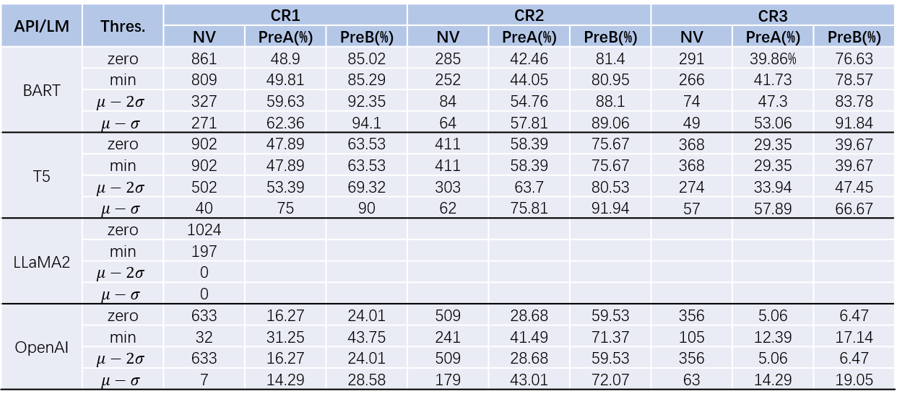

# Supplementary Experiments.
We apply COSTELLO to test [BART](https://huggingface.co/facebook/bart-large-mnli),[T5](https://huggingface.co/google/flan-t5-base), [LLaMA2](https://huggingface.co/meta-llama/Llama-2-7b-chat-hf) and [OpenAI Embedding API](https://platform.openai.com/docs/guides/embeddings/what-are-embeddings).
## How to run
We have collected the embeddings from those models or APIs. You can `cd` into the dir of {BART, LLaMA2, T5, OpenAI} and run 'bash script.sh' to perform the testing and evaluation.
```
cd dir  
bash script.sh
```
## Results
Here is our evaluation result:


COSTELLO also exhibits remarkable effectiveness on BART and T5. 
While its performance on embeddings from LLaMA2 and OpenAI is comparatively lower, it suggests that OpenAI offers higher-quality embeddings,i.e., downstream applications trained on these embeddings exhibit superior performance with less violation of our contrastive relationships, aligning with our expectations to the current state-of-the-art LLMs.

The reason for the declining test precision may be that OpenAI and LLaMA2 provide higher dimensional embeddings, making the analysis more challenging. Also they employ more complex tokenizers, i.e., the lexicon we use to compute thresholds may be less suitable for these latest LLMs.
In our fature work, we will enhance testing effectiveness by exploring more adaptable lexicons for recent LLMs.


