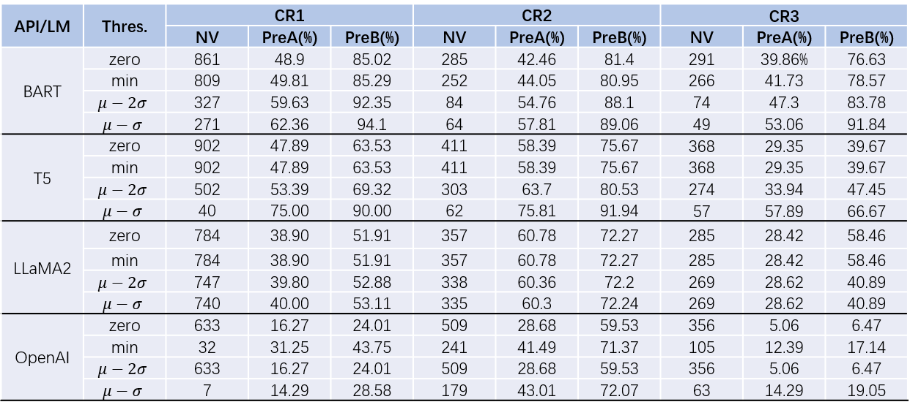

# Supplementary Experiments.
We apply COSTELLO to test [BART](https://huggingface.co/facebook/bart-large-mnli),[T5](https://huggingface.co/google/flan-t5-base), [LLaMA2](https://huggingface.co/meta-llama/Llama-2-7b-chat-hf) and [OpenAI Embedding API](https://platform.openai.com/docs/guides/embeddings/what-are-embeddings).
## How to run
We have collected the embeddings from those models or APIs. You can `cd` the dir in {BART, LLaMA2, T5, OpenAI} and run 'bash script.sh' to perform the testing and evaluating function.
```
cd dir  
bash script.sh
```
## Results
Here is our evaluation result:

[TODO: I will add the results of LLaMA2]

COSTELLO exhibits strong performance on BART and T5. 
While its performance on OpenAI-provided embeddings is comparatively lower, it indirectly suggests that OpenAI offers higher-quality embeddings,i.e., downstream applications trained on these embeddings exhibit superior performance with less validation of our contrastive relationships, aligning with our expectations of the current state-of-the-art LLMs.


The lower test percision may stem from OpenAI's use of a more extensive and intricate token vocabulary. Thus, our current threshold computation based on the sst lexicon proves less effective. In subsequent efforts, we will enhance testing effectiveness by exploring the use of lexicons better suited to recent LLMs for threshold calculation.


